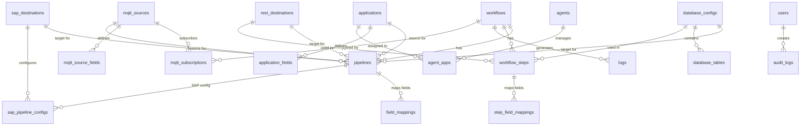
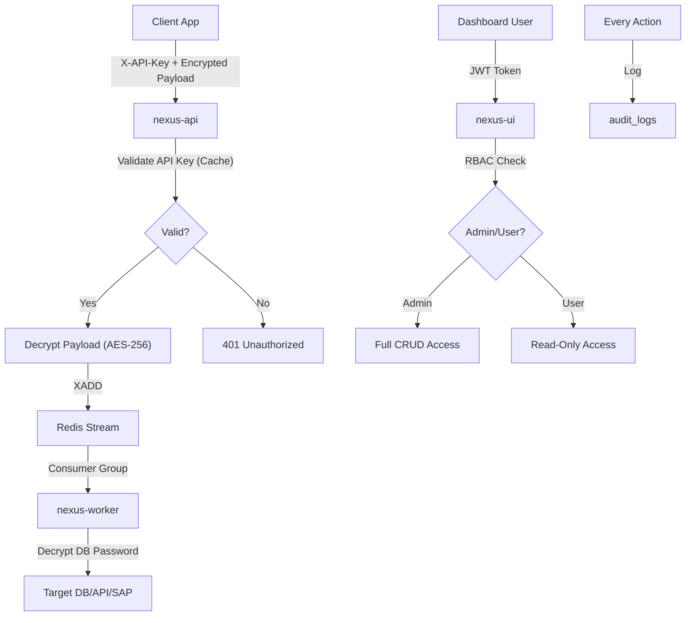

# 📄 Product Requirements Document (PRD)

**Product Name:** Nexus Integration Platform  
**Version:** 2.0 — Based on Actual Codebase Analysis  
**Date:** February 17, 2026  
**Status:** Living Document  

---

## 1. Executive Summary

Nexus is a **cloud-native, lightweight data integration platform** built to bridge modern API ecosystems, IoT data streams, and legacy enterprise systems (including SAP HANA). It replaces heavy Java-based ESBs (UNCAL, MuleSoft) with a modern **Golang + Redis Streams** architecture, delivering zero-data-loss reliability at a fraction of the infrastructure cost.

### 1.1 Core Value Proposition

| Aspect | Description |
|--------|-------------|
| **Zero Data Loss** | Redis Streams with Consumer Groups ensure every message is processed or retried |
| **Lightweight** | Single Go binary per service, ~15MB each, runs on 2GB RAM |
| **Any-to-Any** | Sender Apps → DB, REST API, or SAP HANA. MQTT → DB/REST/SAP. SAP Query → JSON API |
| **Enterprise Security** | AES-256 encryption at rest, JWT auth, RBAC, audit logging |
| **Edge Computing** | `nexus-agent` runs on customer servers with offline queue for unreliable networks |

### 1.2 Target Audience

- **Primary:** Mid-to-Large Enterprises (Fintech, Retail, Manufacturing, Logistics)
- **User Personas:**
  - **Integration Engineer** — configures workflows, mappings, and destinations via UI
  - **DevOps Engineer** — deploys and monitors Nexus via Docker/Kubernetes
  - **Application Developer** — integrates via SDK (Python/JavaScript) or REST API

---

## 2. System Architecture

### 2.1 High-Level Architecture

```
┌─────────────────────────────────────────────────────────────────────────┐
│                         APPLICATION SERVER                              │
│                                                                         │
│  ┌──────────┐   ┌──────────┐   ┌──────────┐   ┌──────────────────┐     │
│  │  Nginx   │   │ nexus-api│   │  nexus   │   │   nexus-query   │     │
│  │  :80     │──▸│  :8080   │   │  worker  │   │     agent       │     │
│  │ (Proxy)  │   │ (Go/Gin) │   │  (Go)    │   │  (SAP HANA)     │     │
│  └──────────┘   └──────────┘   └──────────┘   └──────────────────┘     │
│                      │              │                                    │
│  ┌──────────┐        │              │                                    │
│  │ nexus-ui │        ▼              ▼                                    │
│  │  :3000   │   ┌──────────────────────┐                                │
│  │(Next.js) │   │    Redis Streams     │                                │
│  └──────────┘   │ nexus:workflow:{id}  │                                │
│                 │ nexus:retry_queue    │                                │
│  ┌──────────┐   │ nexus:rest_retry     │                                │
│  │  nexus   │   │ nexus:sap_retry      │                                │
│  │   mqtt   │   └──────────────────────┘                                │
│  │  (Go)    │                                                           │
│  └──────────┘                                                           │
└────────────────────────────┬────────────────────────────────────────────┘
                             │ Private Network
                             ▼
┌─────────────────────────────────────────────────────────────────────────┐
│                         STORAGE SERVER                                  │
│         ┌──────────────┐          ┌──────────────┐                     │
│         │  MySQL :3306 │          │  Redis :6379 │                     │
│         │  (Metadata)  │          │  (Queues)    │                     │
│         └──────────────┘          └──────────────┘                     │
└─────────────────────────────────────────────────────────────────────────┘

┌─────────────────────────────────────────────────────────────────────────┐
│                    CUSTOMER SERVER (Edge)                                │
│         ┌──────────────────┐                                            │
│         │   nexus-agent    │  ← SQLite offline queue                    │
│         │  (Go binary)     │  ← Sends data to nexus-api                │
│         └──────────────────┘                                            │
└─────────────────────────────────────────────────────────────────────────┘
```

### 2.2 Service Inventory

| Service | Language | Purpose | Port |
|---------|----------|---------|------|
| **nexus-api** | Go (Gin) | REST API server, data ingress, workflow CRUD, auth | 8080 |
| **nexus-worker** | Go | Consumes Redis Streams, executes DB/REST/SAP jobs, retry processing | — |
| **nexus-mqtt** | Go | MQTT subscriber, ingests IoT data into Redis Streams | — |
| **nexus-ui** | Next.js + Prisma | Management dashboard, workflow editor, visual mapper | 3000 |
| **nexus-agent** | Go | Edge agent on customer server, local SQLite queue, data forwarding | Configurable |
| **nexus-query-agent** | Go | SAP HANA query executor (SELECT with pagination) | Configurable |
| **nginx** | Nginx Alpine | Reverse proxy, routing `/api` → API, `/` → UI | 80 |

---

## 3. Data Model

### 3.1 Entity Relationship Overview



### 3.2 Core Models (20+ tables)

| Model | Description |
|-------|-------------|
| `workflows` | Integration workflow definition (fan_out or sequential mode) |
| `pipelines` | Connection from source (app/MQTT) to destination (DB/REST/SAP) |
| `field_mappings` | Source → destination column mapping with data type & transforms |
| `workflow_steps` | Steps for sequential workflow execution (rest_call, db_query, transform, condition, delay) |
| `step_field_mappings` | Field mappings per workflow step |
| `applications` | Sender apps with API keys and optional encryption |
| `application_fields` | Schema definition for sender app data |
| `database_configs` | Target database connections (MySQL/PostgreSQL) |
| `database_tables` / `table_fields` | Cached table metadata from destination DBs |
| `rest_destinations` | Target REST API endpoints with auth config |
| `sap_destinations` | SAP HANA ODBC connection config |
| `sap_pipeline_configs` | SAP query config per pipeline (INSERT/UPSERT/UPDATE/DELETE) |
| `mqtt_sources` | MQTT broker connections |
| `mqtt_subscriptions` | Topic subscriptions linked to workflows |
| `mqtt_source_fields` | Field definitions for MQTT payloads |
| `agents` / `agent_apps` | Edge agent instances and their app assignments |
| `users` | User accounts with RBAC (admin/user) |
| `audit_logs` | Security & admin event tracking |
| `logs` | Data transfer logs with status tracking |

---

## 4. Functional Requirements

### 4.1 Data Ingress (P0 — Implemented ✅)

| ID | Feature | Status | Description |
|----|---------|--------|-------------|
| **ING-01** | REST API Ingress | ✅ Done | `POST /ingress` with `X-API-Key` header, validates API key, pushes to Redis Stream |
| **ING-02** | MQTT Ingress | ✅ Done | Subscribe to MQTT topics, auto-translate messages to workflow streams |
| **ING-03** | Agent Ingress | ✅ Done | `nexus-agent` sends data from customer server with local SQLite queue fallback |
| **ING-04** | Public Execute | ✅ Done | `POST /execute/:id` for cron/external trigger of workflows |
| **ING-05** | Encrypted Payloads | ✅ Done | AES-256 payload encryption via SDK with master secret per app |

### 4.2 Workflow Engine (P0 — Implemented ✅)

| ID | Feature | Status | Description |
|----|---------|--------|-------------|
| **WF-01** | Fan-Out Workflow | ✅ Done | One input → multiple parallel destinations (DB + REST + SAP) |
| **WF-02** | Sequential Workflow | ✅ Done | Step-by-step execution with REST calls, DB queries, transforms, conditions, delays |
| **WF-03** | Per-Workflow Streams | ✅ Done | Each workflow gets its own Redis Stream `nexus:workflow:{id}` |
| **WF-04** | Consumer Groups | ✅ Done | Multiple workers can consume same stream without duplication |
| **WF-05** | Redis Retention | ✅ Done | Configurable retention per workflow (default: 168 hours / 7 days) |

### 4.3 Data Destinations (P0 — Implemented ✅)

| ID | Feature | Status | Description |
|----|---------|--------|-------------|
| **DST-01** | Database Destination | ✅ Done | MySQL/PostgreSQL with INSERT, UPSERT, UPDATE, DELETE support |
| **DST-02** | REST API Destination | ✅ Done | Configurable HTTP client (GET/POST/PUT/PATCH/DELETE) with auth (Bearer, API Key, Basic) |
| **DST-03** | SAP HANA Destination | ✅ Done | Direct `go-hdb` connection for INSERT/UPSERT/UPDATE/DELETE with schema/table targeting |
| **DST-04** | Connection Testing | ✅ Done | Test DB/REST/SAP connections before saving, with latency reporting |
| **DST-05** | Password Encryption | ✅ Done | All destination passwords encrypted at rest with AES-256 |

### 4.4 Data Transformation (P1 — Implemented ✅)

| ID | Feature | Status | Description |
|----|---------|--------|-------------|
| **TR-01** | Field Mapping | ✅ Done | Source field → destination column with data type conversion |
| **TR-02** | Transform Functions | ✅ Done | Built-in transforms: type casting, string ops, date formatting |
| **TR-03** | Default Values | ✅ Done | Configurable defaults when source field is null |
| **TR-04** | Null Handling | ✅ Done | Skip, set null, or use default strategy per field |
| **TR-05** | Partial Updates | ✅ Done | Only send fields present in payload (for UPDATE/DELETE) |

### 4.5 Reliability & Retry (P0 — Implemented ✅)

| ID | Feature | Status | Description |
|----|---------|--------|-------------|
| **REL-01** | Retry Queue (DB) | ✅ Done | Failed DB inserts go to `nexus:retry_queue` with exponential backoff |
| **REL-02** | Retry Queue (REST) | ✅ Done | Failed REST calls go to `nexus:rest_retry_queue` |
| **REL-03** | Retry Queue (SAP) | ✅ Done | Failed SAP DML ops go to `nexus:sap_retry_queue` |
| **REL-04** | Max Retries | ✅ Done | Configurable max retries (default: 10) with dead letter handling |
| **REL-05** | Deduplication | ✅ Done | SHA-1 hash deduplication with 24h TTL to prevent duplicate processing |
| **REL-06** | Graceful Shutdown | ✅ Done | Workers finish current jobs before terminating |
| **REL-07** | Connection Pooling | ✅ Done | Shared DB connection pool with mutex protection |

### 4.6 Management Dashboard (P1 — Implemented ✅)

| ID | Feature | Status | Description |
|----|---------|--------|-------------|
| **UI-01** | Workflow Editor | ✅ Done | Visual workflow builder with nodes and edges |
| **UI-02** | Visual Data Mapper | ✅ Done | Source field → destination column mapping UI |
| **UI-03** | Sender App Management | ✅ Done | CRUD for sender applications with field schema editor |
| **UI-04** | Destination Management | ✅ Done | CRUD for DB/REST/SAP destinations with connection testing |
| **UI-05** | Log Viewer | ✅ Done | Real-time log viewer with status filtering |
| **UI-06** | Agent Management | ✅ Done | Register/manage edge agents and assign apps |
| **UI-07** | MQTT Source Management | ✅ Done | MQTT broker and subscription management |
| **UI-08** | User Auth (JWT) | ✅ Done | Login/logout with JWT tokens |
| **UI-09** | Audit Logs | ✅ Done | Security & admin event logs with user tracking |
| **UI-10** | API Documentation | ✅ Done | Built-in API docs page |

### 4.7 Edge Computing — nexus-agent (P1 — Implemented ✅)

| ID | Feature | Status | Description |
|----|---------|--------|-------------|
| **AGT-01** | Data Forwarding | ✅ Done | Receives data from customer apps, forwards to `nexus-api` |
| **AGT-02** | Offline Queue | ✅ Done | SQLite-based local queue when nexus-api is unreachable |
| **AGT-03** | Auto Sync | ✅ Done | Periodically syncs app configs from nexus-api |
| **AGT-04** | App Key Auth | ✅ Done | Validates app keys locally from synced config |
| **AGT-05** | Health Check | ✅ Done | `GET /health` endpoint with queue size and app count |

### 4.8 SAP Integration — nexus-query-agent (P2 — Implemented ✅)

| ID | Feature | Status | Description |
|----|---------|--------|-------------|
| **SAP-01** | Query Executor | ✅ Done | Execute SELECT queries on SAP HANA via ODBC |
| **SAP-02** | Paginated Results | ✅ Done | JSON response with pagination (page, limit) |
| **SAP-03** | DML Operations | ✅ Done | INSERT/UPDATE/UPSERT/DELETE on SAP HANA tables |
| **SAP-04** | Schema Browser | ✅ Done | Browse SAP HANA schemas and tables from UI |

---

## 5. Non-Functional Requirements

### 5.1 Performance

| Metric | Target | Current Implementation |
|--------|--------|----------------------|
| **Ingress Latency** | < 10ms | Redis Streams XADD is sub-millisecond |
| **Processing Throughput** | 10,000+ RPS | Parallel workers with consumer groups |
| **Memory Usage** | < 256MB per service | Go binary ~15MB, low GC pressure |
| **Spike Handling** | 50,000 requests/min | Buffered in Redis Streams |

### 5.2 Security

| Feature | Implementation |
|---------|---------------|
| **API Authentication** | API Key (`X-API-Key`) for ingress, JWT for management |
| **Password Encryption** | AES-256 encryption at rest for all credentials |
| **Payload Encryption** | Optional AES-256 end-to-end encryption via SDK |
| **RBAC** | Admin (full access) & User (limited) roles |
| **Audit Logging** | AUTH, ADMIN, SECURITY, DATA event tracking |
| **Secret Rotation** | Master secret rotation with version tracking |

### 5.3 Deployment

| Environment | Method |
|-------------|--------|
| **Development** | `docker-compose.local.yml` with external MySQL/Redis |
| **Production** | `docker-compose.yml` with separate storage server |
| **Enterprise** | Kubernetes (planned) |
| **Edge** | Single `nexus-agent` binary on customer server |

---

## 6. Tech Stack

| Layer | Technology |
|-------|-----------|
| **Backend API** | Go 1.21+ (Gin framework) |
| **Worker/Processor** | Go (Redis Consumer Groups) |
| **Message Queue** | Redis Streams + Consumer Groups |
| **Frontend** | Next.js (React) + TypeScript |
| **ORM** | Prisma (MySQL) |
| **Primary Database** | MySQL 8.0+ |
| **Supported Targets** | MySQL, PostgreSQL, SAP HANA |
| **Supported Sources** | REST API, MQTT, Agent SDK |
| **Encryption** | AES-256-GCM |
| **Auth** | JWT + API Keys + Bcrypt |
| **Deployment** | Docker Compose / Kubernetes |
| **Edge Agent** | Go binary + SQLite |
| **SDK** | Python, JavaScript |

---

## 7. API Routes

### 7.1 Public / Ingress

| Method | Route | Description |
|--------|-------|-------------|
| POST | `/ingress` | Data ingress with `X-API-Key` |
| POST | `/execute/:id` | Trigger workflow execution |

### 7.2 Management API (JWT Protected)

| Resource | Routes |
|----------|--------|
| **Auth** | POST `/login` |
| **Workflows** | CRUD `/api/workflows`, GET `/api/workflows/:id` |
| **Sender Apps** | CRUD `/api/applications`, fields management |
| **DB Destinations** | CRUD `/api/destinations`, test connection, schema browse |
| **REST Destinations** | CRUD `/api/rest-destinations`, test connection |
| **SAP Destinations** | CRUD `/api/sap-destinations` |
| **SAP Queries** | POST `/api/sap/query`, GET `/api/sap/schemas`, GET `/api/sap/schemas/:name/tables` |
| **MQTT Sources** | CRUD `/api/mqtt-sources`, subscriptions, fields |
| **Agents** | CRUD `/api/agents`, sync, app assignment |
| **Logs** | GET `/api/logs` with filtering |
| **Public Queries** | Query bridging via WebSocket |

---

## 8. Workflow Types

### 8.1 Fan-Out Workflow
Data from one source is simultaneously distributed to multiple destinations.

```
Sender App ──▸ Redis Stream ──▸ Worker ──┬──▸ MySQL (INSERT)
                                         ├──▸ REST API (POST)
                                         └──▸ SAP HANA (UPSERT)
```

### 8.2 Sequential Workflow
Data flows through ordered steps with conditional logic.

```
Trigger ──▸ Step 1: REST Call ──▸ Step 2: Transform ──▸ Step 3: Condition
                                                           │
                                               ┌───────────┴───────────┐
                                               ▼                       ▼
                                     Step 4: DB Insert        Step 5: REST POST
```

**Step types:** `rest_call`, `db_query`, `transform`, `condition`, `delay`
**Error handling:** `stop`, `skip`, `retry` (with configurable max retries)

---

## 9. Pipeline Source Types

| Source Type | Description | Configuration |
|-------------|-------------|---------------|
| **sender_app** | REST API ingress via SDK or HTTP POST | API Key, field schema, optional encryption |
| **mqtt_source** | MQTT topic subscription | Broker URL, topic pattern, QoS, payload format (JSON/raw/CSV) |

---

## 10. Destination Types & Query Operations

| Destination | Supported Operations | Connection Details |
|-------------|---------------------|-------------------|
| **Database (MySQL/PostgreSQL)** | SELECT, INSERT, UPSERT, UPDATE, DELETE | Host, port, database, username, encrypted password |
| **REST API** | GET, POST, PUT, PATCH, DELETE | Base URL, method, headers, auth (None/Bearer/API Key/Basic) |
| **SAP HANA** | SELECT, INSERT, UPSERT, UPDATE, DELETE | Host, port, database name, DSN, username, encrypted password |

---

## 11. Security Model



---

## 12. SDK Support

### 12.1 Python SDK
- Located in `nexus-core/sdk/python/`
- Supports encrypted payload sending via AES-256
- Simple `send()` method with app key authentication

### 12.2 JavaScript SDK
- Located in `nexus-core/sdk/js/`
- Browser and Node.js compatible
- Supports encrypted payload sending

---

## 13. Roadmap & Status

### Phase 1: Trustable Core ✅ COMPLETE
- ✅ Redis Streams with consumer groups
- ✅ DB connector (MySQL/PostgreSQL) with all CRUD ops
- ✅ REST API connector with auth
- ✅ Retry queues with exponential backoff
- ✅ Management dashboard
- ✅ Data transfer logging

### Phase 2: The Integrator ✅ COMPLETE
- ✅ Visual workflow editor with data mapper
- ✅ MQTT ingress for IoT data
- ✅ RBAC (Admin/User roles)
- ✅ Audit logging
- ✅ Edge agent with offline queue
- ✅ SDK (Python & JavaScript)

### Phase 3: Enterprise ✅ IN PROGRESS
- ✅ SAP HANA adapter (DML + Query)
- ✅ Sequential workflow engine
- ✅ Schema browser for SAP
- 🔲 ClickHouse integration for massive log retention
- 🔲 ISO 8583 (Banking) adapter
- 🔲 Kubernetes operator
- 🔲 OpenTelemetry observability

### Phase 4: Scale & Polish (Planned)
- 🔲 Real-time metrics dashboard (RPS, error rates)
- 🔲 Visual trace view (end-to-end message tracking)
- 🔲 File connector (CSV/Excel streaming)
- 🔲 Webhook destinations
- 🔲 Multi-tenant support
- 🔲 Rate limiting per app
- 🔲 API versioning

---

## 14. Known Technical Debt

| Issue | Impact | Recommendation |
|-------|--------|---------------|
| Worker `main.go` is 3,453 lines | Hard to maintain | Refactor into packages: `dbworker`, `restworker`, `sapworker`, `retry` |
| All structs in worker `main` package | No reusability | Move job structs to `internal/models` |
| No structured logging | Hard to debug in production | Adopt `zerolog` or `zap` with correlation IDs |
| No metrics/tracing | No observability | Add Prometheus metrics + OpenTelemetry traces |
| Config loaded via YAML + env | Inconsistent | Standardize on `viper` or single config source |
| Prisma schema owns migrations | UI coupled to DB | Consider Go migrations for backend parity |
| No automated tests | Risky deployments | Add unit tests for worker, integration tests for API |

---

## 15. Risks & Mitigation

| Risk | Impact | Mitigation |
|------|--------|-----------|
| **Redis Memory Full** | Critical — system stops | Max length on streams + offload to disk/ClickHouse |
| **SAP ODBC Dependency** | Limits SAP deployment | Use `go-hdb` direct driver (already implemented) |
| **Worker Single Point of Failure** | Data processing halts | Scale workers horizontally via consumer groups |
| **No Automated Testing** | Regressions on deploy | Priority: add integration tests for critical paths |
| **3,400-line Worker Monolith** | Dev velocity slows | Refactor into modular packages |

---

## 16. Deployment Checklist

- [ ] Generate unique `NEXUS_JWT_SECRET` and `NEXUS_ENCRYPTION_KEY`
- [ ] Configure MySQL on storage server with `nexus` database
- [ ] Configure Redis on storage server with password
- [ ] Run Prisma migrations: `npx prisma migrate deploy`
- [ ] Create admin user via SQL or `tools/hash_password.go`
- [ ] Build and run: `docker compose up -d --build`
- [ ] Verify: `curl http://localhost/api/health`
- [ ] Configure firewall: MySQL (3306) and Redis (6379) from app server only
- [ ] Set up log rotation for Docker containers

---

*Document generated from codebase analysis on February 17, 2026.*
